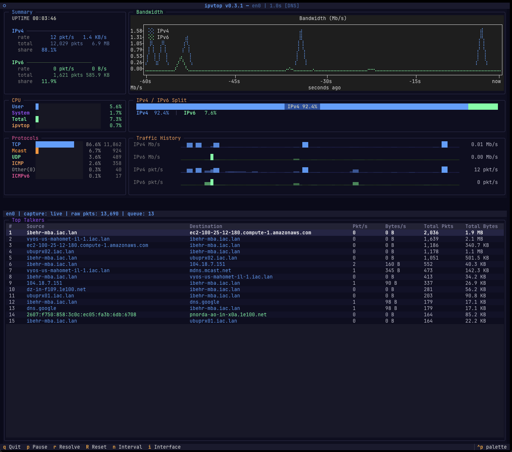

# ipvtop

A real-time network traffic monitor for the terminal with IPv4/IPv6 breakdown. Inspired by [btop](https://github.com/aristocratos/btop).

Built with [Textual](https://github.com/Textualize/textual), [Plotext](https://github.com/piccolomo/plotext), and [Scapy](https://scapy.net/).

## Build Status
[](https://github.com/ibehren1/ipvtop/actions/workflows/build.yml)

## Features

- Live packet capture with a configurable refresh interval
- IPv4 vs IPv6 traffic breakdown across all panels
- Rolling 60-second bandwidth chart (Mb/s) with braille-dot plotting
- Sparkline history for packets/s and Mb/s per protocol version
- Visual IPv4/IPv6 traffic split bar
- Top talkers table with one row per source → destination flow, showing both per-second rates and cumulative totals
- Session-wide protocol breakdown (TCP, UDP, ICMP, ICMPv6, GRE, ESP, AH, SCTP, Multicast)
- CPU usage panel (user / system / total / ipvtop process)
- Optional reverse-DNS resolution of IPs to hostnames, toggleable at runtime
- Pick an interface from a menu at startup or switch interfaces at runtime
- Pause, reset stats, and change the refresh interval without restarting
- btop-inspired dark theme with rounded borders and color-coded panels
- Runs on Linux and macOS

## Screenshot



## Installation

### Pre-built binaries

Download the latest binary for your platform from [GitHub Releases](../../releases):

| Platform | Architecture | Download |
|----------|-------------|----------|
| Linux    | x86_64      | `ipvtop-linux-x86_64` |
| Linux    | ARM64       | `ipvtop-linux-arm64` |
| macOS    | ARM64       | `ipvtop-macos-arm64` |

```bash
chmod +x ipvtop-*
sudo ./ipvtop-linux-x86_64 eth0
```

### From source with uv

```bash
git clone https://github.com/ibehren1/ipvtop.git
cd ipvtop
uv sync
sudo uv run ipvtop eth0
```

### With pip

```bash
pip install .
sudo ipvtop eth0
```

## Usage

```
usage: ipvtop [-h] [-v] [-l] [-n INTERVAL] [-r] [interface]

Real-time network traffic monitor with IPv4/IPv6 breakdown

positional arguments:
  interface             Network interface to monitor (e.g., eth0, wlan0); if
                        omitted, you'll be prompted to choose one at startup

options:
  -h, --help            show this help message and exit
  -v, --version         Show the version and exit
  -l, --list            List available network interfaces and exit
  -n INTERVAL, --interval INTERVAL
                        Screen refresh interval in seconds (default: 1.0)
  -r, --resolve         Reverse-DNS resolve source/dest IPs, showing hostnames
                        when available
```

### Examples

```bash
# List available interfaces
ipvtop -l

# Monitor a specific interface (requires root)
sudo ipvtop eth0        # Linux
sudo ipvtop en0         # macOS

# Launch without an interface to pick one from a menu (requires root)
sudo ipvtop

# Resolve source/dest IPs to hostnames via reverse DNS
sudo ipvtop -r eth0

# Run from source with uv
sudo uv run ipvtop eth0
```

### Keybindings

| Key | Action |
|-----|--------|
| `q` | Quit |
| `p` | Pause / resume display |
| `r` | Toggle reverse-DNS resolution of IPs |
| `R` | Reset all statistics |
| `n` | Change refresh interval |
| `i` | Choose / switch the monitored interface |

Pressing `i` opens a menu of available interfaces (the one currently being monitored is marked). Selecting a different interface restarts capture on it and resets statistics. If you launch ipvtop without naming an interface, this menu opens automatically at startup.

## Dashboard panels

The dashboard is arranged in two columns above a full-width Top Talkers table. The left column (25% width) stacks Summary, CPU, and Protocols; the right column (75% width) stacks Bandwidth, the IPv4 / IPv6 Split bar, and Traffic History.

### Summary

Displays running totals and per-second rates for IPv4 and IPv6 traffic (packets and bytes), the IPv4:IPv6 ratio, and session uptime.

### Bandwidth

A 60-second rolling line chart rendered with braille characters showing IPv4 and IPv6 throughput in Mb/s.

### IPv4 / IPv6 Split

A stacked bar showing the cumulative byte ratio between IPv4 (blue) and IPv6 (green) with embedded percentage labels.

### Traffic History

Four sparkline rows showing rolling 60-second history:
- IPv4 Mb/s
- IPv6 Mb/s
- IPv4 packets/s
- IPv6 packets/s

### Top Talkers

A single data table showing the top flows — each row is one source → destination conversation with its per-second packet and byte rates plus cumulative packet and byte totals. IPs are color-coded blue (v4) or green (v6). With reverse-DNS resolution enabled (the `-r` flag or the `r` key), endpoints display their resolved hostname when a PTR record is found, falling back to the raw IP otherwise.

### CPU

A compact bar panel showing CPU utilization, refreshed each tick: `User`, `System`, `Total`, and the share consumed by the `ipvtop` process itself (normalized to system-wide percentage). Bars turn orange above 50% and red above 80%.

### Protocols

Horizontal bar chart showing the session-wide distribution of traffic across protocols (TCP, UDP, ICMP, ICMPv6, GRE, ESP, AH, SCTP). Counts accumulate over the whole session (cleared by the `R` key), so the bars reflect the running protocol mix rather than just the latest tick. Packets sent to a multicast destination (IPv4 `224.0.0.0/4` or IPv6 `ff00::/8`) are bucketed as `Multicast` instead of their layer-4 protocol.

## Color scheme

The interface uses a btop-inspired dark theme:

| Element | Color |
|---------|-------|
| IPv4    | Blue (`#50a0ff`) |
| IPv6    | Green (`#50ffa0`) |
| ICMP    | Orange (`#ffa050`) |
| ICMPv6  | Pink (`#ff50a0`) |
| Multicast | Amber (`#ff9020`) |
| CPU warning (>50%) | Orange (`#ffa050`) |
| CPU critical (>80%) | Red (`#ff5050`) |
| Background | Dark blue-black (`#0a0a1a`) |
| Panel borders | Rounded, muted (`#303050`) |

## Building binaries

### Local build

```bash
uv sync --dev
uv run pyinstaller ipvtop.spec --clean --noconfirm
# Binary at dist/ipvtop
```

### CI/CD

The GitHub Actions workflow (`.github/workflows/build.yml`) builds binaries for all four platform/architecture combinations.

**Automatic release** on tag push:

```bash
git tag v0.1.0
git push origin v0.1.0
```

This triggers a build of all four binaries, generates SHA256 checksums, and creates a GitHub Release with the artifacts attached.

**Manual build** via the Actions tab using "Run workflow".

## Requirements

- Python >= 3.10
- Root privileges (for raw packet capture)
- A terminal emulator with 256-color support

### Dependencies

| Package | Purpose |
|---------|---------|
| [textual](https://github.com/Textualize/textual) | TUI framework |
| [textual-plotext](https://github.com/Textualize/textual-plotext) | Terminal charts |
| [scapy](https://scapy.net/) | Packet capture and parsing |
| [psutil](https://github.com/giampaolo/psutil) | CPU usage metrics |

## Platform notes

### macOS

Promiscuous mode is not supported on most macOS interfaces. ipvtop automatically disables it and captures in normal mode, which sees all traffic to and from your machine.

### Linux

Works out of the box with `sudo`. Alternatively, grant the binary the `CAP_NET_RAW` capability to avoid running as root:

```bash
sudo setcap cap_net_raw+ep ./ipvtop
./ipvtop eth0
```

## License

MIT — Copyright © 2026 Isaac B. Behrens. All rights reserved.
